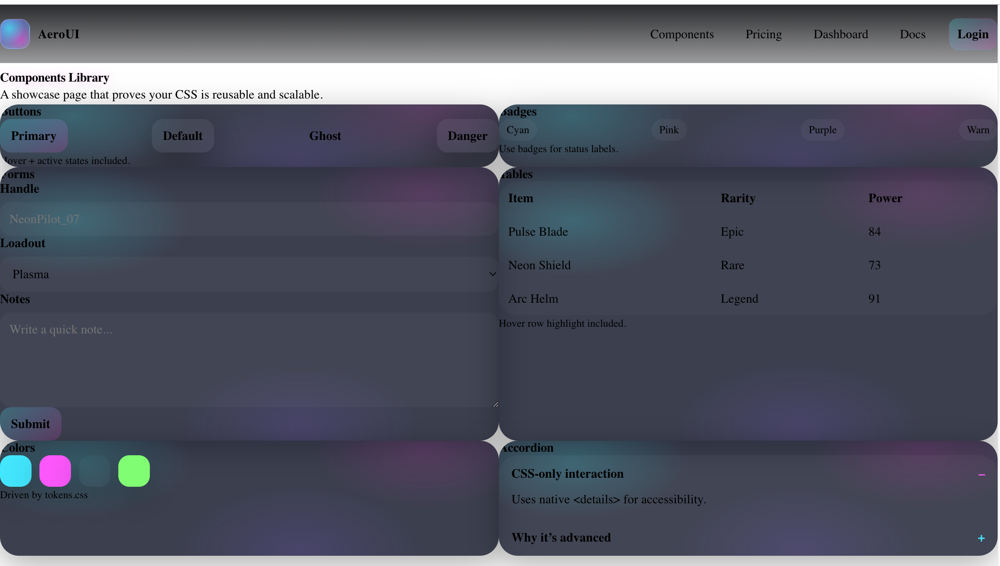

# AeroUI (Gaming/Neon) — HTML + CSS Design System

A multi-page, CSS-only design system and product site built to demonstrate advanced HTML/CSS skills:
responsive layout architecture, reusable components, modern CSS tokens, and accessible UI patterns.

## Pages
- Home: `index.html`
- Components: `pages/components.html`
- Pricing: `pages/pricing.html`
- Dashboard: `pages/dashboard.html`
- Docs: `pages/docs.html`
- Login: `pages/login.html`

## Highlights
- Design tokens via CSS variables (`css/tokens.css`)
- Responsive grids + layout utilities (`css/layout.css`)
- Reusable components (`css/components.css`)
- CSS-only mobile navigation (checkbox toggle)
- Accessible accordion using `
/
`
- Neon gaming UI style with gradients and glow effects

## Run locally
Just open `index.html` in your browser (no build step needed).

## Screenshot of the Website
